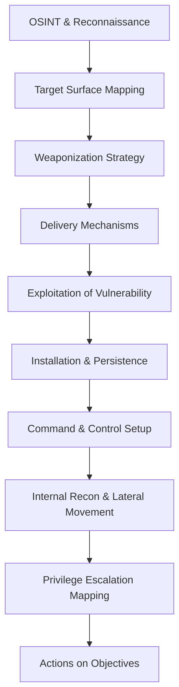

# Red Team & Penetration Testing Methodology

## The Cyber Kill Chain & Attack Lifecycle
Offensive security operations model adversarial progression through distinct phases. The Lockheed Martin Cyber Kill Chain establishes the prerequisite sequence for successful exploitation: Reconnaissance, Weaponization, Delivery, Exploitation, Installation, Command and Control (C2), and Actions on Objectives. Disrupting any node in this graph theoretically neutralizes the threat.

## MITRE ATT&CK Framework Integration
The MITRE ATT&CK framework provides a standardized taxonomy of adversary Tactics, Techniques, and Procedures (TTPs). Red team engagements map operational steps to these matrices (e.g., Initial Access, Execution, Persistence) to objectively measure the defensive posture and detection efficacy of the target organization.

## OSINT Conceptual Framework
Open-Source Intelligence (OSINT) represents the passive intelligence gathering phase. It relies on aggregating public footprints—DNS records, BGP routes, organizational charts, and digital exhaust—to construct a comprehensive attack surface map without direct interaction with the target's infrastructure.

## Theoretical Mechanics of Privilege Escalation
Privilege escalation exploits conceptual flaws in system architecture and access control models. It involves transitioning from a constrained security context to an administrative one. Vertically, this relies on abusing kernel vulnerabilities, misconfigured service permissions, or token manipulation. Horizontally, it leverages stolen credentials to move laterally across equivalent trust domains. The focus is strictly on architectural mapping of trust boundaries, devoid of actionable exploitation payloads.

