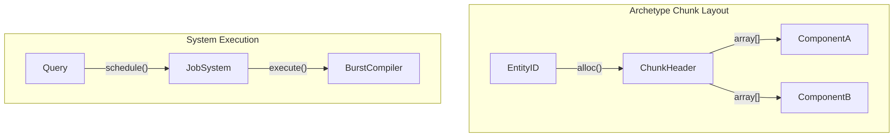

# Unity Data-Oriented Technology Stack (DOTS)

## Entity Component System (ECS)
Unity's ECS completely overhauls the traditional `MonoBehaviour` object-oriented approach in favor of memory-contiguous data layouts to maximize CPU cache utilization.

### Archetypes and Chunks
An `Entity` is merely a 32-bit integer ID. A `Component` is a strict `struct` containing only data (blittable types). When an Entity is assigned a specific combination of Components, this combination defines its `Archetype`. 
Memory is allocated in `Chunks` (typically 16KB). A Chunk exclusively stores Entities of a single Archetype. This SoA (Structure of Arrays) layout ensures that when a System queries for Entities with specific Components (e.g., `Translation` and `Velocity`), the CPU prefetcher streams consecutive bytes of data directly into L1/L2 caches, virtually eliminating cache misses.

### Systems and the Burst Compiler
`Systems` provide the logic. They execute queries against Archetypes and iterate over Chunks. Combined with the C# Job System, DOTS allows lock-free multithreading. The `Burst Compiler` translates IL to highly optimized native machine code using LLVM, taking advantage of SIMD (Single Instruction Multiple Data) instructions automatically due to the strict pointer aliasing guarantees provided by the `[ReadOnly]` and `[ReadWrite]` attributes on component data.

