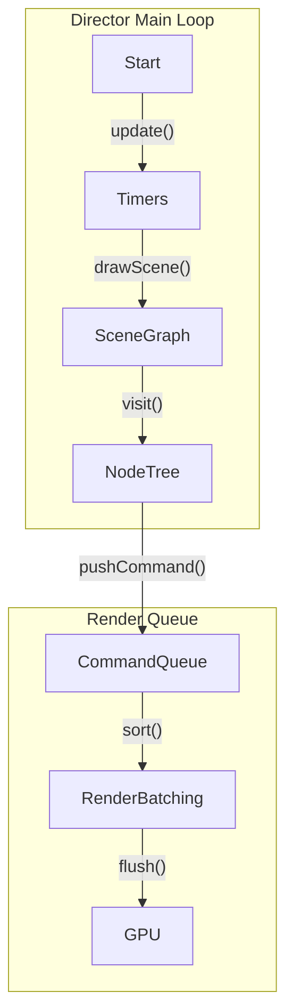

# Cocos2d-x Architectural Patterns

## Scene Graph Rendering and the Director Lifecycle
The heart of Cocos2d-x is the `Director` singleton, responsible for the game's main loop, rendering pipeline, and scene management. The Director orchestrates the `mainLoop()`, which iteratively performs calculations (updating the simulation) and triggers the draw call.

The rendering architecture heavily relies on a Scene Graph, a tree structure representing all visual elements (`Node`). Each `Node` can contain child nodes, applying local transformations (translation, rotation, scale, skew) that are hierarchically multiplied by the parent's transformation matrix to compute the Model-View-Projection (MVP) matrix. 

During the rendering phase, the `Director` visits the active `Scene` node recursively via a depth-first traversal, invoking the `visit()` method on each child. Render commands (`RenderCommand`) are not executed immediately during traversal; instead, they are pushed into a `Renderer` queue. The `Renderer` then sorts these commands (e.g., by Z-order, transparent vs opaque) to minimize state changes and batch draw calls for optimal OpenGL/Metal performance.

