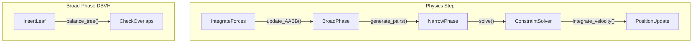

# Physics Engine Internals

## Broad-phase vs Narrow-phase Collision
Physics simulations process collision detection in two distinct phases to maintain O(N log N) or better performance.
1. **Broad-phase**: Generates pairs of potentially intersecting objects. Utilizes spatial partitioning algorithms like Dynamic Bounding Volume Hierarchies (DBVH), Octrees, or Sweep-and-Prune (SAP) on Axis-Aligned Bounding Boxes (AABBs). This phase aggressively rejects distant pairs.
2. **Narrow-phase**: Performs exact geometric intersection tests on the pairs produced by the broad-phase. Implements algorithms such as the Separating Axis Theorem (SAT) or the Gilbert-Johnson-Keerthi (GJK) algorithm combined with Expanding Polytope Algorithm (EPA) to extract penetration depth and contact normals.

## Integration Methods
Once forces are accumulated and collisions resolved, the engine must integrate equations of motion.
- **Explicit Euler**: `v += a * dt; x += v * dt`. Computationally cheap but highly unstable, gaining energy over time.
- **Semi-implicit Euler (Symplectic Euler)**: Resolves velocity before position. Preserves volume in phase space and is unconditionally stable for harmonic oscillators, making it the standard for real-time physics.
- **Verlet / RK4**: Used for cloth simulation or high-precision requirements, offering better energy conservation at the cost of higher CPU cycles.

