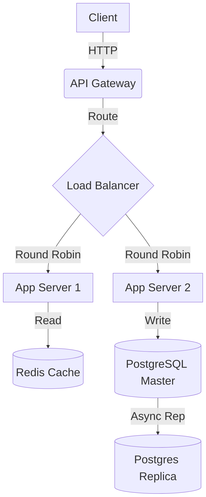
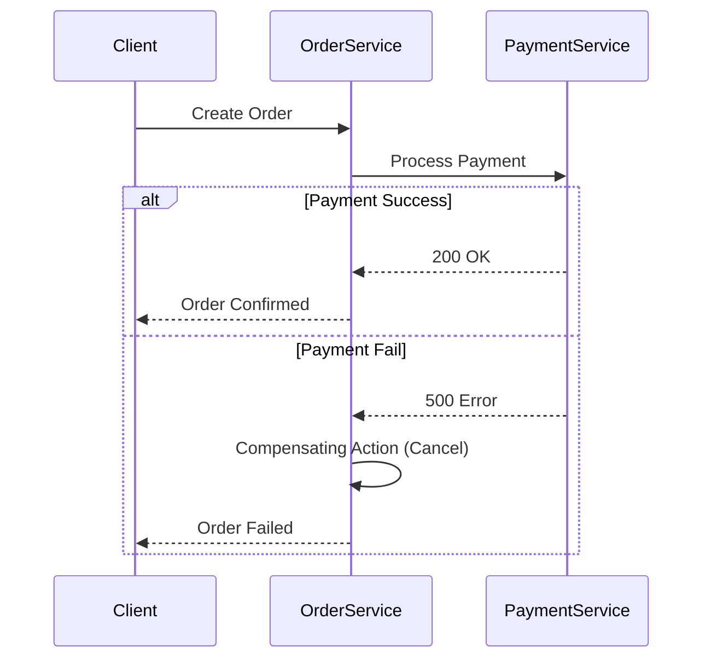

# Deployment Pipelines

## 1. Advanced Strategy and Execution

To optimize **Deployment Pipelines**, we enforce the following foundational rules:

- **PACELC Theorem**: An extension of CAP; even without partitions, trade-offs between Latency and Consistency exist.
- **Rate Limiting**: Token bucket and leaky bucket algorithms to prevent API abuse and manage quotas.
- **Vector Clocks**: Logical clocks used to determine the partial ordering of events in distributed systems.

### Core Implementation

```java
public class CircuitBreaker {
    private AtomicInteger failures = new AtomicInteger(0);
    private final int threshold = 5;
    
    public Response execute(Supplier<Response> action) {
        if (failures.get() >= threshold) throw new CircuitOpenException();
        try {
            Response res = action.get();
            failures.set(0); // Reset on success
            return res;
        } catch (Exception e) {
            failures.incrementAndGet();
            throw e;
        }
    }
}
```


---

## 2. Advanced Strategy and Execution

To optimize **Deployment Pipelines**, we enforce the following foundational rules:

- **Database Sharding**: Horizontally partitioning data across nodes using a routing key to bypass vertical scaling limits.
- **Saga Pattern**: Managing distributed transactions through a sequence of local transactions and compensating actions.
- **Event Sourcing**: Storing the state of an application as a sequence of immutable events.
- **PACELC Theorem**: An extension of CAP; even without partitions, trade-offs between Latency and Consistency exist.

### Mathematical Thresholds
$$ P(false\_positive) = (1 - e^{-kn/m})^k \text{ for Bloom Filters} $$

---

## 3. Advanced Strategy and Execution

To optimize **Deployment Pipelines**, we enforce the following foundational rules:

- **PACELC Theorem**: An extension of CAP; even without partitions, trade-offs between Latency and Consistency exist.
- **Saga Pattern**: Managing distributed transactions through a sequence of local transactions and compensating actions.
- **Raft Consensus**: Leader election and log replication algorithm designed for understandability over Paxos.

### System Architecture




---

## 4. Advanced Strategy and Execution

To optimize **Deployment Pipelines**, we enforce the following foundational rules:

- **Bloom Filters**: Probabilistic data structures used to rapidly verify if an element definitely does not exist.
- **CQRS Pattern**: Segregating write models (Commands) from read models (Queries) for independent scaling.
- **Gossip Protocol**: Decentralized node communication ensuring eventual cluster awareness.
- **Vector Clocks**: Logical clocks used to determine the partial ordering of events in distributed systems.
- **Distributed Caching**: Utilizing Redis/Memcached to absorb read-heavy traffic and reduce latency.

### Mathematical Thresholds
$$ \text{Availability} = \frac{\text{MTBF}}{\text{MTBF} + \text{MTTR}} $$

---

## 5. Advanced Strategy and Execution

To optimize **Deployment Pipelines**, we enforce the following foundational rules:

- **Idempotency Keys**: Ensuring safe retries in distributed networks by preventing duplicate state mutations.
- **Circuit Breakers**: Failing fast when a downstream service is struggling, preventing cascading outages.
- **Consistent Hashing**: Maps data to nodes using a hash ring, minimizing key redistribution when nodes scale.
- **Bloom Filters**: Probabilistic data structures used to rapidly verify if an element definitely does not exist.
- **Vector Clocks**: Logical clocks used to determine the partial ordering of events in distributed systems.

### Core Implementation

```java
public class CircuitBreaker {
    private AtomicInteger failures = new AtomicInteger(0);
    private final int threshold = 5;
    
    public Response execute(Supplier<Response> action) {
        if (failures.get() >= threshold) throw new CircuitOpenException();
        try {
            Response res = action.get();
            failures.set(0); // Reset on success
            return res;
        } catch (Exception e) {
            failures.incrementAndGet();
            throw e;
        }
    }
}
```


---

## 6. Advanced Strategy and Execution

To optimize **Deployment Pipelines**, we enforce the following foundational rules:

- **Vector Clocks**: Logical clocks used to determine the partial ordering of events in distributed systems.
- **Saga Pattern**: Managing distributed transactions through a sequence of local transactions and compensating actions.
- **Read-Heavy vs Write-Heavy**: Designing tailored indexes, materialized views, and LSM trees based on access patterns.
- **Bloom Filters**: Probabilistic data structures used to rapidly verify if an element definitely does not exist.

### System Architecture




---

## 7. Advanced Strategy and Execution

To optimize **Deployment Pipelines**, we enforce the following foundational rules:

- **PACELC Theorem**: An extension of CAP; even without partitions, trade-offs between Latency and Consistency exist.
- **Circuit Breakers**: Failing fast when a downstream service is struggling, preventing cascading outages.
- **Event Sourcing**: Storing the state of an application as a sequence of immutable events.

### Core Implementation

```python
def get_consistent_hash_node(key, nodes, virtual_nodes=100):
    ring = {}
    for node in nodes:
        for i in range(virtual_nodes):
            hash_val = hash(f"{node}:{i}")
            ring[hash_val] = node
    
    key_hash = hash(key)
    for h in sorted(ring.keys()):
        if h >= key_hash:
            return ring[h]
    return ring[min(ring.keys())]
```


---

## 8. Advanced Strategy and Execution

To optimize **Deployment Pipelines**, we enforce the following foundational rules:

- **Bloom Filters**: Probabilistic data structures used to rapidly verify if an element definitely does not exist.
- **Idempotency Keys**: Ensuring safe retries in distributed networks by preventing duplicate state mutations.
- **Rate Limiting**: Token bucket and leaky bucket algorithms to prevent API abuse and manage quotas.

### Mathematical Thresholds
$$ \text{Latency}_{p99} \approx \text{Queue Wait Time} + \text{Service Time} \implies O(\lambda) \text{ via Little's Law} $$

---

## 9. Advanced Strategy and Execution

To optimize **Deployment Pipelines**, we enforce the following foundational rules:

- **Gossip Protocol**: Decentralized node communication ensuring eventual cluster awareness.
- **Idempotency Keys**: Ensuring safe retries in distributed networks by preventing duplicate state mutations.
- **Rate Limiting**: Token bucket and leaky bucket algorithms to prevent API abuse and manage quotas.

### System Architecture


---

## 10. Advanced Strategy and Execution

To optimize **Deployment Pipelines**, we enforce the following foundational rules:

- **Circuit Breakers**: Failing fast when a downstream service is struggling, preventing cascading outages.
- **Saga Pattern**: Managing distributed transactions through a sequence of local transactions and compensating actions.
- **Distributed Caching**: Utilizing Redis/Memcached to absorb read-heavy traffic and reduce latency.
- **Bloom Filters**: Probabilistic data structures used to rapidly verify if an element definitely does not exist.
- **Idempotency Keys**: Ensuring safe retries in distributed networks by preventing duplicate state mutations.

### Mathematical Thresholds
$$ P(false\_positive) = (1 - e^{-kn/m})^k \text{ for Bloom Filters} $$

---

## 11. Advanced Strategy and Execution

To optimize **Deployment Pipelines**, we enforce the following foundational rules:

- **PACELC Theorem**: An extension of CAP; even without partitions, trade-offs between Latency and Consistency exist.
- **Rate Limiting**: Token bucket and leaky bucket algorithms to prevent API abuse and manage quotas.
- **Distributed Caching**: Utilizing Redis/Memcached to absorb read-heavy traffic and reduce latency.
- **Database Sharding**: Horizontally partitioning data across nodes using a routing key to bypass vertical scaling limits.

### Core Implementation

```python
def get_consistent_hash_node(key, nodes, virtual_nodes=100):
    ring = {}
    for node in nodes:
        for i in range(virtual_nodes):
            hash_val = hash(f"{node}:{i}")
            ring[hash_val] = node
    
    key_hash = hash(key)
    for h in sorted(ring.keys()):
        if h >= key_hash:
            return ring[h]
    return ring[min(ring.keys())]
```


---
