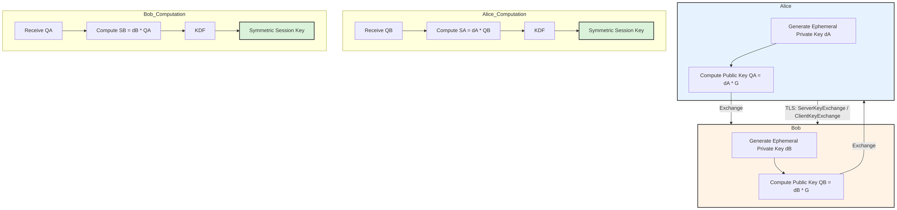

# Modern Cryptography: ECC, Key Exchange, and Post-Quantum Security

The bedrock of secure communications (TLS, SSH, VPNs) relies on asymmetric cryptography for key exchange and digital signatures. The landscape is shifting from traditional RSA to Elliptic Curve Cryptography (ECC) and, imminently, to Post-Quantum Cryptography (PQC).

## Elliptic Curve Cryptography (ECC)

ECC provides equivalent security to RSA but with significantly smaller key sizes, resulting in faster computations and lower bandwidth requirements. 

*   **Mathematical Basis**: ECC is based on the algebraic structure of elliptic curves over finite fields. The security relies on the Elliptic Curve Discrete Logarithm Problem (ECDLP): Given a base point $G$ on the curve and a point $P$ such that $P = kG$ (where $k$ is a scalar), it is computationally infeasible to determine the private key $k$ given only $P$ and $G$.
*   **Public/Private Keys**: 
    *   **Private Key ($d$)**: A randomly selected integer.
    *   **Public Key ($Q$)**: A point on the curve, calculated as $Q = d \times G$ (scalar multiplication).
*   **Standard Curves**: Curve25519 (developed by D. J. Bernstein) is highly favored for its performance and resistance to timing attacks, heavily utilized in modern TLS 1.3 and WireGuard. NIST curves (e.g., P-256, P-384) are also ubiquitous.

## Elliptic Curve Diffie-Hellman Ephemeral (ECDHE)

ECDHE is the standard key exchange mechanism in modern protocols, providing Perfect Forward Secrecy (PFS). PFS ensures that even if long-term private keys are compromised in the future, past session keys cannot be derived.

### The Exchange Process:
1.  **Parameter Agreement**: Alice and Bob agree on a specific elliptic curve and base point $G$.
2.  **Ephemeral Key Generation**:
    *   Alice generates a temporary private key $d_A$ and computes her public key $Q_A = d_A \times G$.
    *   Bob generates a temporary private key $d_B$ and computes his public key $Q_B = d_B \times G$.
3.  **Exchange & Authentication**: Alice and Bob exchange $Q_A$ and $Q_B$. (In TLS, these public keys are typically signed by the sender's long-term identity key, e.g., an RSA or ECDSA certificate, to prevent Man-in-the-Middle attacks).
4.  **Shared Secret Computation**:
    *   Alice computes $S_A = d_A \times Q_B = d_A \times (d_B \times G)$.
    *   Bob computes $S_B = d_B \times Q_A = d_B \times (d_A \times G)$.
    *   Due to the associative property, $S_A = S_B$. This is the shared secret point on the curve.
5.  **Key Derivation Function (KDF)**: The x-coordinate of the shared secret point is passed through a KDF (like HKDF) to derive symmetric keys for bulk encryption (e.g., AES-GCM or ChaCha20-Poly1305).

## Post-Quantum Cryptography (PQC)

Shor's algorithm, running on a sufficiently powerful quantum computer, can solve both the integer factorization problem (breaking RSA) and the ECDLP (breaking ECC) in polynomial time. PQC aims to establish algorithms resistant to both quantum and classical computers.

*   **NIST Standardization**: NIST has selected algorithms to standardize for PQC.
    *   **Key Encapsulation Mechanisms (KEMs) / Key Exchange**: Kyber (ML-KEM). Based on the Module Learning with Errors (MLWE) problem over lattices.
    *   **Digital Signatures**: Dilithium (ML-DSA), Falcon, and SPHINCS+ (stateless hash-based).
*   **Lattice-Based Cryptography**: The core of Kyber and Dilithium. Security is based on the hardness of problems like the Shortest Vector Problem (SVP) or Learning With Errors (LWE) in high-dimensional lattices. It's difficult to find a vector close to a given point without the "trapdoor" information.
*   **Hybrid Key Exchange**: During the transition phase, protocols (like TLS implementations in Chrome/Cloudflare) use a hybrid approach (e.g., X25519Kyber768Draft00): performing both a classical ECDHE exchange and a PQC Kyber exchange, combining the resulting secrets. This ensures security even if the novel PQC algorithm is broken, as long as ECC remains secure against classical attacks.

## Architecture Mapping

