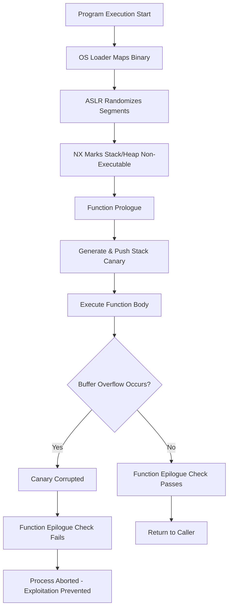

# Reverse Engineering & Low-Level Binary Analysis

To master vulnerability research, one must profoundly understand the structural formats of executables and the low-level execution environment that governs memory safety and corruption.

## 1. Binary Structures (PE & ELF)

Executable formats (Portable Executable for Windows, Executable and Linkable Format for Unix) define how the operating system loader maps the file into memory.

- **PE Structure**: Contains the DOS Header, PE Header, Optional Header (defining ImageBase, AddressOfEntryPoint), and Section Headers (`.text` for code, `.data` for initialized variables, `.rdata` for read-only data).
- **ELF Structure**: Comprises the ELF Header, Program Headers (segments for execution), and Section Headers (for linking). Understanding the `.plt` (Procedure Linkage Table) and `.got` (Global Offset Table) is vital for analyzing dynamically linked binaries and understanding control flow redirection.

## 2. Decompilation Theory

Decompilers (e.g., IDA Pro, Ghidra) transform machine code back into high-level pseudo-code. This process involves:
- **Disassembly**: Translating opcodes to assembly mnemonics.
- **Control Flow Graph (CFG) Recovery**: Identifying basic blocks and determining execution paths (branches, loops).
- **Data Flow Analysis**: Tracking register and stack variable usage to reconstruct high-level data types and function signatures (SSA - Static Single Assignment form).

## 3. Memory Corruption Mechanics: Buffer Overflows

A buffer overflow occurs when a program writes more data to a block of memory (buffer) than it was allocated to hold. In languages like C/C++, lack of bounds checking leads to adjacent memory corruption.

- **Stack-Based Overflows**: Overwriting the saved Return Instruction Pointer (RIP/EIP) on the call stack allows an attacker to hijack control flow upon function epilogue (`ret` instruction).
- **Heap-Based Overflows**: Corrupting heap metadata (e.g., `malloc` chunk headers) can lead to arbitrary write primitives during memory allocation/deallocation (`free()`).

## 4. Operating System Defensive Mitigations

Modern operating systems employ robust mitigations to break the predictability required for successful exploitation.

- **ASLR (Address Space Layout Randomization)**: Randomizes the base addresses of the executable, heap, stack, and libraries. Mitigated theoretically via information leaks.
- **DEP (Data Execution Prevention) / NX (No-Execute)**: Marks memory pages (like the stack and heap) as non-executable. Control flow hijacking must instead rely on reusing existing executable code (e.g., Return-Oriented Programming - ROP).
- **Stack Canaries**: Places a randomized, cryptographic value between local variables and the saved return pointer. If modified, the program aborts before returning.

## Memory Mitigation Lifecycle

