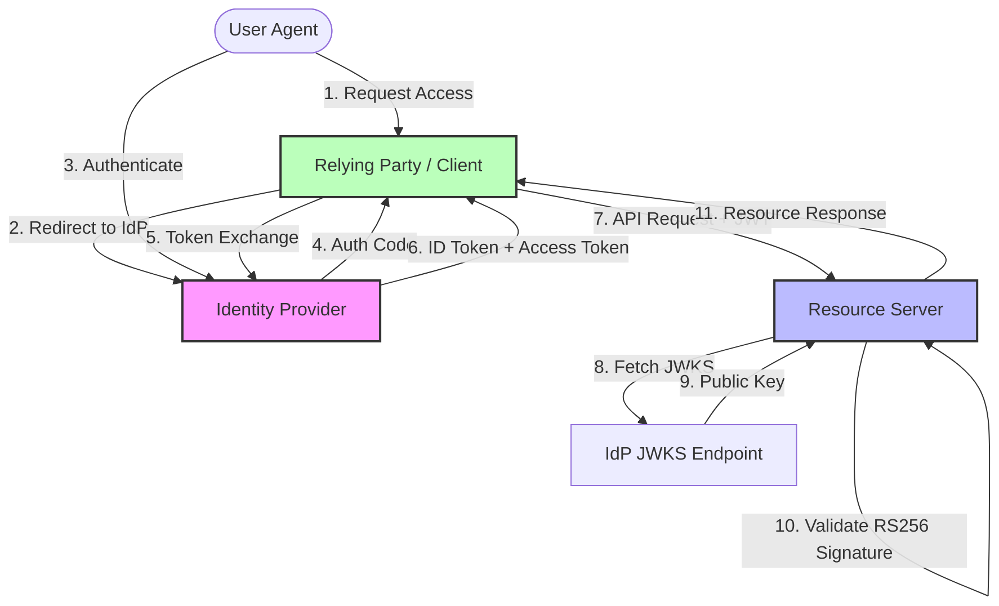

# Zero Trust Identity Architecture and Authentication Flows

Zero Trust assumes hostility at all network boundaries, mandating explicit verification of identity and device context for every access request. This reference details the underlying mechanisms of primary identity federations and token validations.

## OIDC (OpenID Connect) and OAuth2 Flows

OIDC is an identity layer built on top of the OAuth 2.0 protocol. The Authorization Code Flow (often with PKCE) is the gold standard for secure authentication.

1. **Authorization Request**: The client redirects the user-agent to the authorization server (`/authorize`) with `response_type=code`, a `client_id`, `redirect_uri`, `scope=openid`, and `state`/`nonce`/`code_challenge`.
2. **Authentication & Consent**: The user authenticates. The server validates the credentials and requests consent if necessary.
3. **Authorization Response**: The server redirects the user-agent back to the `redirect_uri` with an authorization `code` and the `state` parameter for CSRF mitigation.
4. **Token Request**: The client authenticates to the token endpoint (`/token`), exchanging the `code` and `code_verifier` (PKCE) for an ID Token (JWT) and an Access Token.

## JWT Signature Validation (RS256 vs HS256)

JWTs (JSON Web Tokens) encapsulate claims in a compact, URL-safe format. Validation of the signature is paramount to prevent token forgery.

*   **HS256 (HMAC with SHA-256)**: Symmetric signing. The Identity Provider (IdP) and the Resource Server (RS) share the same secret key. **Risk**: If the RS is compromised, the shared secret is exposed, allowing the attacker to forge JWTs. Suitable only for internal, tightly-coupled microservices.
*   **RS256 (RSA Signature with SHA-256)**: Asymmetric signing. The IdP signs the JWT with its private key. The RS validates the signature using the IdP's public key (retrieved via JWKS - JSON Web Key Set). **Benefit**: The RS only holds the public key; compromise does not lead to token forgery capabilities.

### Validation Steps:
1.  **Format**: Ensure the token is three base64url-encoded strings separated by dots.
2.  **Header Analysis**: Decode the header to verify the `alg` (algorithm) is expected (e.g., preventing algorithm substitution attacks where `alg` is changed from RS256 to HS256, forcing the RS to use the public key as a symmetric HMAC secret).
3.  **Signature Verification**: Recompute the signature over the `Header.Payload` string using the specified algorithm and appropriate key, then strictly compare it against the signature appended to the token.
4.  **Claim Validation**: Verify `exp` (expiration), `iss` (issuer), and `aud` (audience).

## SAML (Security Assertion Markup Language) Mechanics

SAML relies on XML and SOAP/HTTP POST bindings. It is heavily utilized in legacy enterprise SSO.

1.  **SP-Initiated Flow**: The Service Provider (SP) generates an `<AuthnRequest>`, signs it, deflates it, base64 encodes it, and redirects the user to the IdP.
2.  **Authentication**: The IdP authenticates the user.
3.  **SAML Response**: The IdP constructs a `<samlp:Response>` containing `<saml:Assertion>` elements (Attributes, Authentication context). The assertion (and often the entire response) is digitally signed (XML Signature) using the IdP's private key.
4.  **Assertion Consumer Service (ACS)**: The IdP POSTs the response to the SP's ACS URL. The SP validates the XML signature using the IdP's certificate and processes the assertions.

## Architecture Mapping

