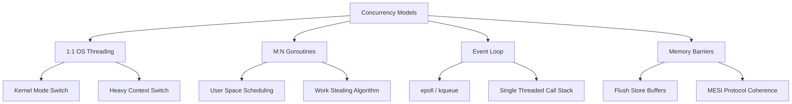

# Concurrency Mechanics: Deep Architecture & Under-the-Hood Operations

## 1. Threading & OS Scheduling Context
Operating System threads (1:1 model) are scheduled directly by the kernel's scheduler (e.g., CFS in Linux). Thread context switching involves saving/restoring CPU registers, the program counter, and the stack pointer, incurring significant overhead (in the realm of 1-5 microseconds) and requiring user-to-kernel mode transitions. Thread stacks consume fixed memory (e.g., 1-8 MB), making a high-concurrency model fundamentally unscalable on commodity hardware due to the C10K problem. 

## 2. Goroutines and M:N Scheduling
The M:N scheduler (like Go's) multiplexes M user-space threads (goroutines) onto N OS threads. 
- **P (Processor):** Context for execution, maintaining a local run queue (LRQ).
- **M (Machine):** The OS thread executing user code.
- **G (Goroutine):** The user thread with dynamic stack sizing (starting at 2KB).
The Go scheduler uses **Work Stealing**: if a P exhausts its LRQ, it randomly steals half the Gs from another P's LRQ. If an M blocks (e.g., synchronous syscall), the P detaches and binds to an idle M to continue executing other Gs, minimizing kernel context switches.

## 3. The Single-Threaded Event Loop (Reactor Pattern)
Node.js and Redis utilize a single-threaded Event Loop processing non-blocking I/O. The mechanics rely on OS-level multiplexing (epoll/kqueue).
- **Call Stack:** Executes synchronous V8 operations.
- **Task Queue / Microtask Queue:** Promises and callbacks.
The loop constantly polls for completed I/O operations and enqueues callbacks. While CPU-bound tasks block the loop, I/O bound scalability is achieved via asynchronous continuation.

## 4. Synchronization: Race Conditions and Memory Barriers
A race condition is an unprotected non-atomic read-modify-write sequence.
**Memory Barriers (Fences):** Hardware instructions that enforce ordering constraints on memory operations. Modern CPUs employ Out-of-Order (OoO) execution and store buffers. A memory fence (e.g., `mfence` on x86) flushes store buffers to L1 cache and invalidates other cores' cache lines via cache coherence protocols (MESI), ensuring sequential consistency for atomic operations or mutex boundaries.

