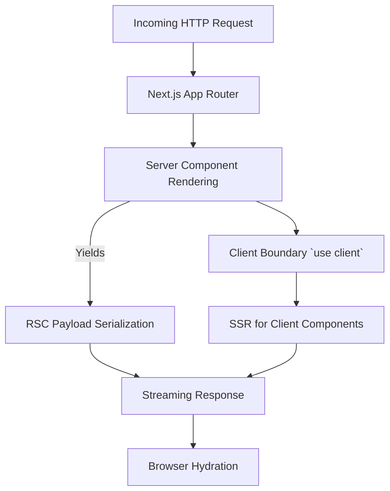

# Next.js Internals: RSC, Client Boundaries, and Streaming SSR

## React Server Components (RSC) and App Router Mechanics
Next.js App Router utilizes React Server Components to fundamentally split the React render tree. RSCs are executed strictly on the server (or at build time), generating a specialized JSON-like format (the RSC payload). This payload is streamed to the client, omitting the component's JavaScript bundle. Client boundaries (marked by `"use client"`) denote the point where the server passes serialized props to client components, which are hydrated on the browser. 

Streaming SSR leverages React's `Suspense` and the Node.js/Edge streams API to incrementally flush HTML chunks to the browser before the entire rendering lifecycle completes. This minimizes TTFB and maximizes FCP by deferring the execution and data fetching of non-critical UI segments.

## Architecture

