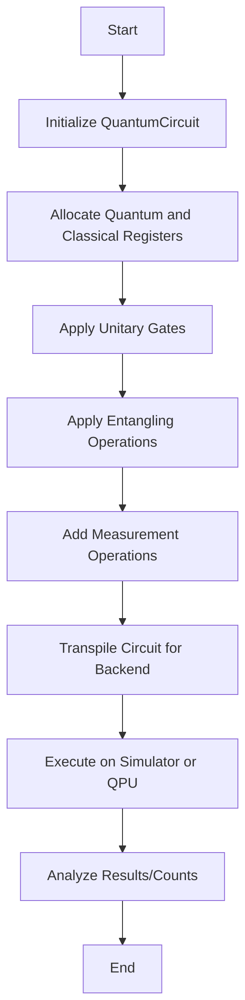

# Qiskit Framework

Qiskit is IBM's open-source SDK for quantum computing. It provides a programmatic abstraction for designing quantum circuits, compiling them for specific architectures, and executing them on simulators or physical QPUs.

## Theoretical Foundation & Architecture

Quantum circuits in Qiskit are represented as DAGs (Directed Acyclic Graphs). A `QuantumCircuit` instance holds `QuantumRegister` and `ClassicalRegister` objects. Unitary operations (gates) manipulate the quantum state space $\mathbb{C}^{2^n}$, while measurements collapse the state onto the computational basis, recording outcomes in classical bits.

## Actionable Execution

1. **Initialization:** Instantiate `QuantumCircuit(n, m)` with $n$ qubits and $m$ classical bits. All qubits initialize to $|0\rangle$.
2. **Gate Application:** 
   - Apply single-qubit gates (e.g., `qc.h(0)`, `qc.rx(theta, 0)`).
   - Apply entangling two-qubit gates (e.g., `qc.cx(0, 1)` for CNOT).
3. **Measurement:** Map quantum states to classical registers (`qc.measure(qubit_index, bit_index)`).
4. **Execution:** Transpile the circuit for a target backend and invoke `run()`.

## Execution Flow

