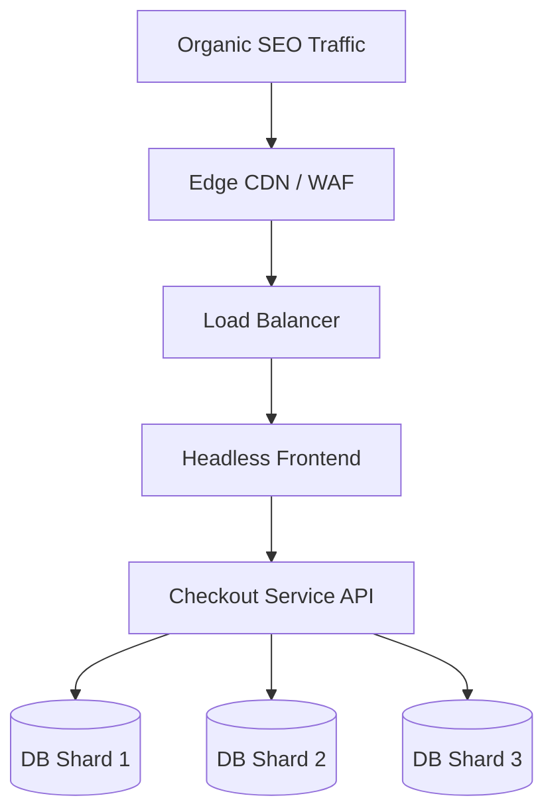

# High-Scale E-Commerce Playbook

**AUTHORITATIVE. DENSE. MẠNH.**

## 1. Core Architecture
- **Programmatic SEO**: Edge-rendered, dynamically generated product pages for max indexability.
- **Headless Checkout**: API-first, decoupled payment flow. Sub-second latency.
- **Database Sharding**: Write-heavy order flows distributed across physical shards. Zero single point of failure.

## 2. System Flow



## 3. Infrastructure (Kubernetes)

```yaml
apiVersion: apps/v1
kind: Deployment
metadata:
  name: checkout-service
spec:
  replicas: 20
  selector:
    matchLabels:
      app: checkout
  template:
    metadata:
      labels:
        app: checkout
    spec:
      containers:
      - name: checkout-app
        image: registry/checkout:latest
        resources:
          limits:
            cpu: "4"
            memory: "8Gi"
        env:
        - name: SHARDING_STRATEGY
          value: "REGION_BASED"
```
