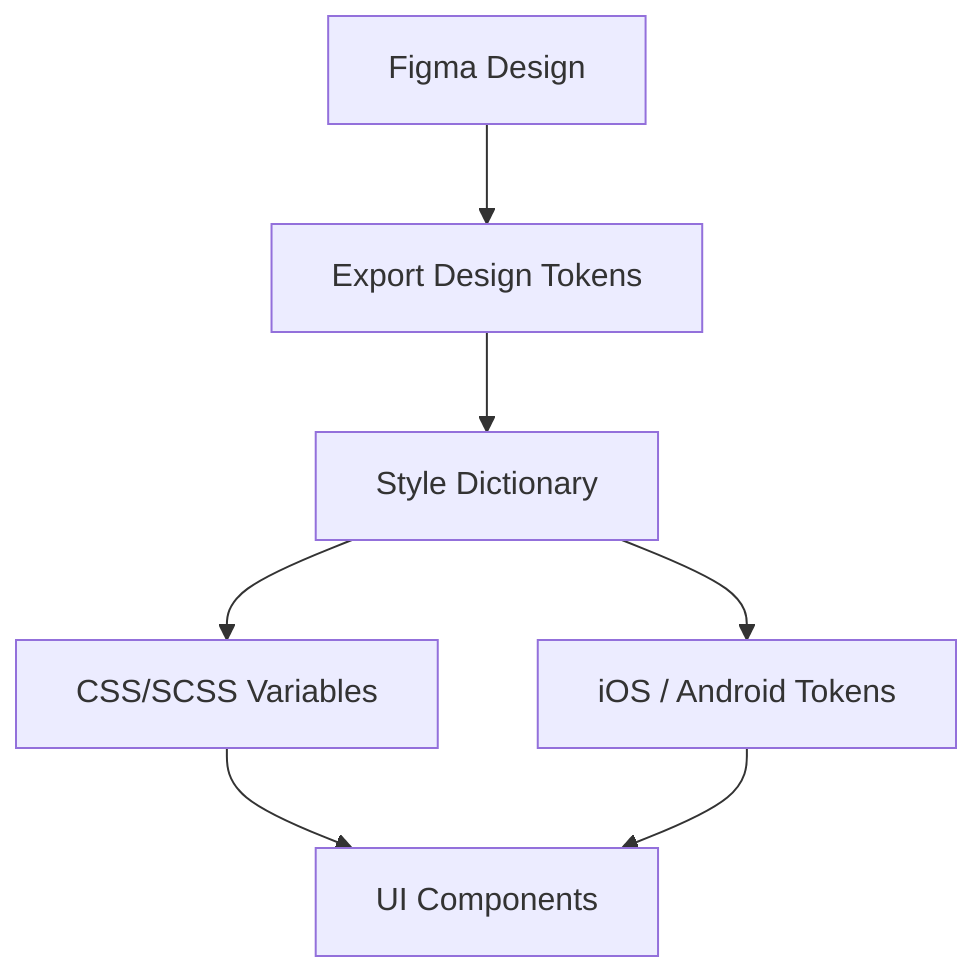

# Design Systems

Master design system architecture to create consistent, maintainable, and scalable UI foundations
across web and mobile applications, with a design-to-code pipeline that keeps Figma and the
codebase in sync.

## Core Principles

- **Consistency**: Reusable components and tokens across the UI — not one-off styling per screen.
- **Single Source of Truth**: Design tokens sync Figma and the codebase; neither drifts independently.

## When to Use This Skill

- Creating design tokens for colors, typography, spacing, and shadows
- Implementing light/dark theme switching with CSS custom properties
- Building multi-brand theming systems
- Establishing design-to-code workflows with Figma tokens
- Creating semantic token hierarchies (primitive, semantic, component)
- Generating tokens for multiple platforms (web, iOS, Android) from one source

## Figma to Code Workflow



Token export from Figma (via the Tokens Studio plugin or Figma Variables API) feeds Style
Dictionary, which transforms one JSON source into platform-specific outputs — CSS custom
properties for web, `.swift`/`.xml` for iOS/Android — so a single token change propagates
everywhere without hand-editing each platform.

## Core Capabilities

### 1. Design Tokens

- Primitive tokens (raw values: colors, sizes, fonts)
- Semantic tokens (contextual meaning: `text-primary`, `surface-elevated`)
- Component tokens (specific usage: `button-bg`, `card-border`)
- Token naming conventions and organization
- Multi-platform token generation (CSS, iOS, [Android](../../../../Mobile/platforms/android/SKILL.md))

```json
{
  "color": {
    "primary": { "value": "#0052cc", "type": "color" },
    "text": { "value": "#172b4d", "type": "color" }
  }
}
```

### 2. Theming Infrastructure

- CSS custom properties architecture
- Theme context providers in React
- Dynamic theme switching
- System preference detection (`prefers-color-scheme`)
- Persistent theme storage
- Reduced motion and high contrast modes

### 3. Component Architecture

- Compound component patterns
- Polymorphic components (`as` prop)
- Variant and size systems
- Slot-based composition
- Headless UI patterns
- Style props and responsive variants

### 4. Token Pipeline

- Figma to code synchronization (Tokens Studio, Figma Variables API)
- Style Dictionary configuration and transforms
- Token transformation and formatting per platform
- CI/CD integration so a token change opens a PR automatically instead of drifting silently

## Detailed patterns and worked examples

Detailed pattern documentation lives in `../../../references/design-system-patterns_details.md`. Read that file when the navigation tier above is insufficient.

## Best Practices

1. **Name Tokens by Purpose**: Use semantic names (`text-primary`) not visual descriptions (`dark-gray`)
2. **Maintain Token Hierarchy**: Primitives > Semantic > Component tokens
3. **Document Token Usage**: Include usage guidelines with token definitions
4. **Version Tokens**: Treat token changes as API changes with semver
5. **Test Theme Combinations**: Verify all themes work with all components
6. **Automate Token Pipeline**: CI/CD for Figma-to-code synchronization
7. **Provide Migration Paths**: Deprecate tokens gradually with clear alternatives

## Common Issues

- **Token Sprawl**: Too many tokens without clear hierarchy
- **Inconsistent Naming**: Mixed conventions (camelCase vs kebab-case)
- **Missing Dark Mode**: Tokens that don't adapt to theme changes
- **Hardcoded Values**: Using raw values instead of tokens
- **Circular References**: Tokens referencing each other in loops
- **Platform Gaps**: Tokens missing for some platforms (web but not mobile)

## Handoff

For the rigorous component-API/CVA-variant/three-tier-token implementation guide, use
`frontend-design-system` (`../design-system/SKILL.md`).
