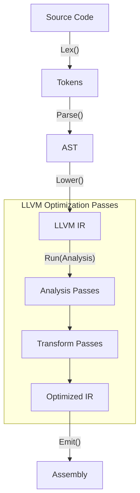

# Compiler Design Mechanics

## Lexical & Syntax Analysis
The frontend of a compiler transforms source code into an Abstract Syntax Tree (AST). Lexical analysis (tokenization) utilizes finite automata (DFA/NFA) to group characters into tokens. Syntax analysis relies on context-free grammars (CFGs) parsed via LL(k) or LR(1) parsers to ensure grammatical correctness and build the AST.

## AST Generation & Lowering
The AST represents the hierarchical syntactic structure of the program. During semantic analysis, symbol tables are populated, and type checking is performed. The AST is then lowered into an Intermediate Representation (IR), which is independent of both the source language and the target machine architecture.

## LLVM IR Passes
LLVM IR is a Static Single Assignment (SSA) based representation. Optimization passes operate on this IR. 
- **Analysis Passes:** Compute properties of the program (e.g., dominator trees, alias analysis).
- **Transform Passes:** Mutate the IR (e.g., Dead Code Elimination (DCE), Loop Unrolling, Constant Propagation).
The PassManager schedules these passes to ensure dependency constraints are met before emitting target-specific assembly.

