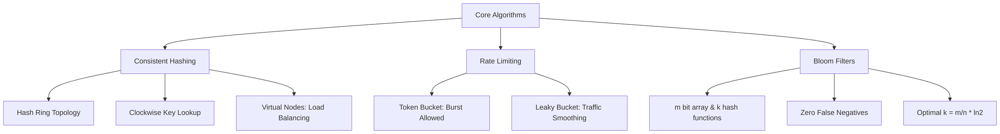

# System Design Core Algorithms

## 1. Consistent Hashing and Virtual Nodes
Standard modulo hashing (`hash(key) % N`) causes catastrophic remapping when a node is added or removed, invalidating `(N-1)/N` keys.
**Consistent Hashing** maps keys and nodes onto a conceptual ring (e.g., integer range `[0, 2^32-1]`). A key belongs to the first node encountered clockwise.
- **Rebalancing:** Node addition/removal only affects its immediate predecessor's keys, remapping only `K/N` keys.
- **Virtual Nodes (vnodes):** To solve data skew, each physical node is assigned multiple hash points (vnodes) on the ring. The variance in load distribution decreases logarithmically with the number of vnodes.

## 2. Rate Limiting Algorithms
- **Token Bucket:** Focuses on burst capacity. A bucket holds up to `B` tokens. Tokens are added at a constant rate `R`. A request consumes `N` tokens. If empty, the request is rejected. It allows bursts up to the bucket capacity while sustaining long-term rate `R`.
- **Leaky Bucket:** Focuses on smoothing traffic. Requests enter a queue (bucket) of size `Q`. A background process dequeues and processes them at a constant rate `R`. Burst traffic fills the queue; excess is dropped (traffic shaping).

## 3. Bloom Filters: Probabilistic Verification
A Bloom Filter is a space-efficient probabilistic data structure used to test set membership. 
- **Mechanics:** An array of `m` bits initialized to 0. `k` independent hash functions map an item to `k` bit indices, setting them to 1.
- **Verification:** To check membership, hash the item `k` times. If all `k` bits are 1, it is *probably* in the set. If any bit is 0, it is *definitely not*.
- **Mathematics:** The probability of a false positive `p` depends on bits `m`, inserted elements `n`, and hash functions `k`. Optimal `k = (m/n) * ln(2)`. Highly utilized in LSM-Trees to skip reading SSTables that do not contain a key.

