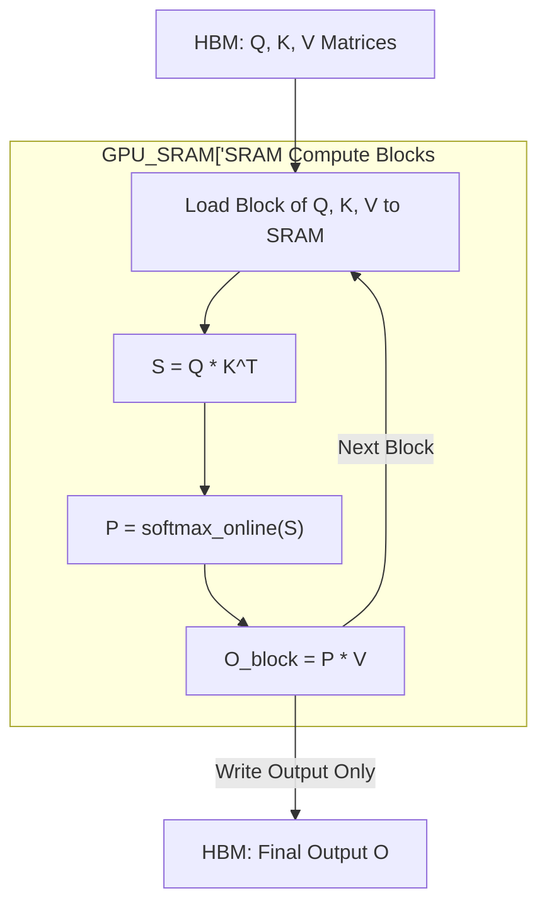

# FlashAttention: Hardware-Aware Exact Attention

Standard attention is memory-bound, bottlenecked by excessive reads/writes between High Bandwidth Memory (HBM) and SRAM during the $O(N^2)$ attention matrix materialization. FlashAttention reorders the computation to eliminate these HBM accesses.

## Hardware Physics & Bottlenecks
Modern GPUs execute math much faster than they can fetch data. The Roofline Model dictates that Transformer inference/training is bounded by memory bandwidth.
- **HBM**: Large (e.g., 80GB on A100), but slow (1.5-2.0 TB/s).
- **SRAM**: Tiny (e.g., 20MB per SM), but ultra-fast (19 TB/s).

## Core Mechanisms
1. **Tiling**: Deconstructs the $N \times N$ softmax into blocks that fit within SRAM. By computing attention block-by-block, we keep the intermediate matrices ($S$ and $P$) entirely in SRAM, writing only the final output $O$ to HBM.
2. **Recomputation**: In the backward pass, instead of saving the huge intermediate attention matrix to HBM (which consumes massive memory and bandwidth), FlashAttention recomputes it on-the-fly from $Q, K, V$ in SRAM.

## Mathematical Formulation (Online Softmax)
To compute softmax incrementally over blocks, we track running maximums and normalizers:
$m^{(x)} = \max(m^{(x-1)}, \max(x))$
$l^{(x)} = l^{(x-1)} e^{m^{(x-1)} - m^{(x)}} + \sum e^{x - m^{(x)}}$

## Data Flow

