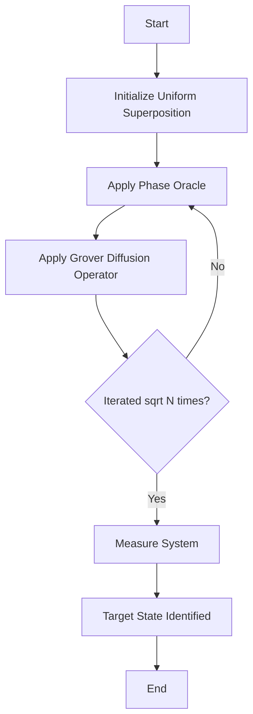

# Grover's Algorithm

Grover's algorithm provides a quadratic speedup for unstructured search problems. It operates on a search space of size $N=2^n$ in $O(\sqrt{N})$ operations, utilizing the principle of amplitude amplification.

## Theoretical Foundation

Let $f(x) = 1$ for the target state $x_0$ and $f(x) = 0$ otherwise. An oracle $O$ flips the phase of the target state:
$$ O|"x\rangle = (-1)^{f(x)}"|x\rangle $$

The Grover diffusion operator $D = 2|s\rangle\langle s| - I$ performs inversion about the mean, amplifying the probability amplitude of the marked state. Here $|s\rangle$ is the uniform superposition state.

## Actionable Execution

1. **Initialization:** Prepare a uniform superposition $|s\rangle = H^{\otimes n}|0\rangle^{\otimes n}$.
2. **Oracle Application:** Apply the phase oracle $O$ to mark the target state.
3. **Diffusion:** Apply the Grover diffusion operator $D$.
4. **Iteration:** Repeat steps 2 and 3 approximately $\frac{\pi}{4}\sqrt{N}$ times.
5. **Measurement:** Measuring the state yields the target $x_0$ with near certainty.

## Execution Flow

