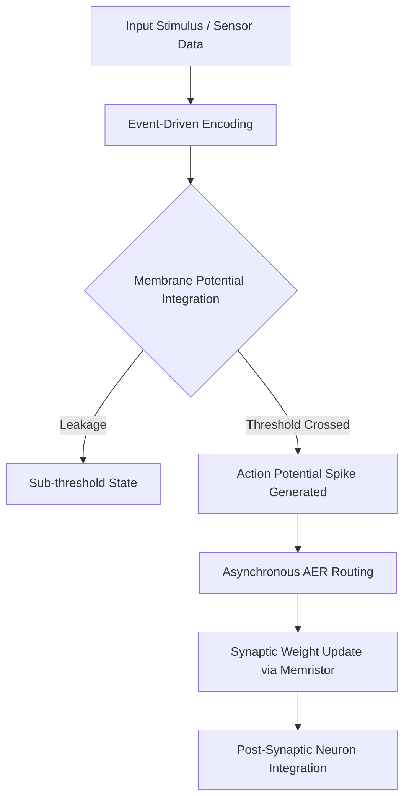

# Neuromorphic Computing: The Asynchronous Frontier

Classical von Neumann architectures face an insurmountable energy wall: the physical separation of compute and memory necessitates constant data shuttling, consuming milliwatts to watts per operation. Neuromorphic computing shatters this paradigm by co-locating memory and processing at the synaptic level, enabling micro-watt, event-driven computation.

## 1. Spiking Neural Networks (SNNs) & Event-Driven Processing
Unlike continuous-valued Artificial Neural Networks (ANNs) operating on synchronous clock cycles, SNNs communicate via discrete, asynchronous voltage spikes. Computation occurs **only** when a neuron's membrane potential surpasses a critical threshold. This sparsity is the bedrock of neurobiological efficiency. 

## 2. Memristors: Synaptic Transistors
The memristor (memory resistor) acts as a physical analog to a biological synapse. By modulating internal resistance based on the history of applied voltage/current, memristors intrinsically perform multiply-accumulate (MAC) operations directly in the analog domain. This eliminates the von Neumann bottleneck entirely.

## 3. Asynchronous Architecture & The Death of the Global Clock
Clock distribution networks in classical silicon consume up to 30% of total dynamic power. Neuromorphic fabrics utilize Address Event Representation (AER) for asynchronous spike routing. Components remain completely dormant (consuming zero dynamic power) until triggered by incoming spike events.

