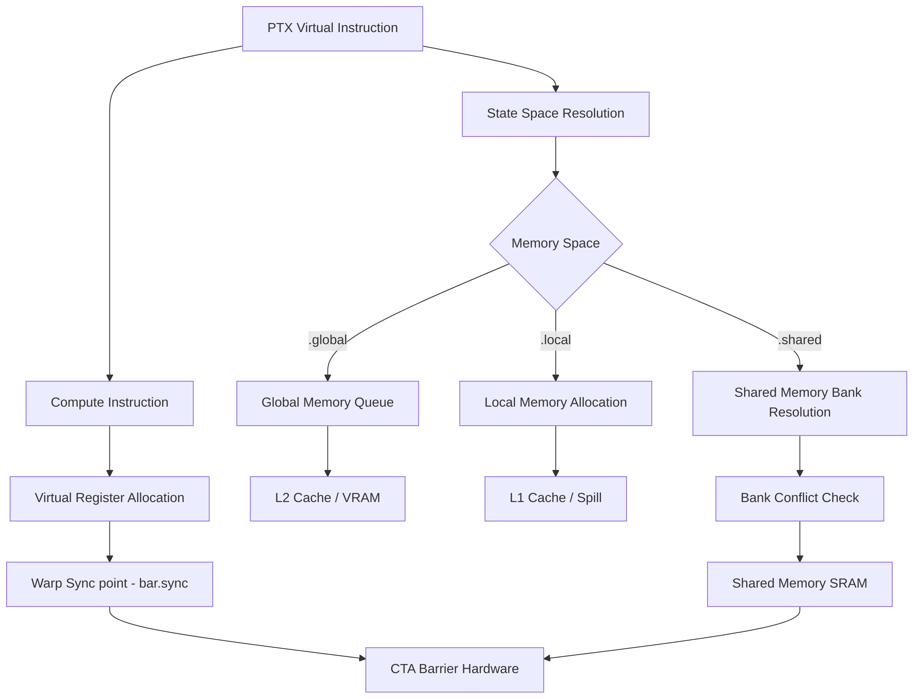

# PTX Assembly and Execution Model

As a Principal GPU Microarchitecture Engineer, you must understand PTX (Parallel Thread Execution) not merely as an assembly language, but as an intermediate representation of the Streaming Multiprocessor (SM) state machine. PTX dictates the virtualized datapath before the ptxas compiler maps it to physical silicon.

## Register Allocation & Liveness
PTX exposes an infinite virtual register file. The allocation algorithm must resolve register pressure during the lowering to SASS. High register pressure leads to local memory spilling, drastically impacting memory bandwidth and L1 cache hit rates. You must strategically scope variable lifetimes and explicitly manage virtual registers to optimize warp occupancy.

## Memory Spaces & Explicit Pointers
The NVIDIA GPU memory hierarchy is rigidly partitioned. PTX requires explicit state space qualifiers to direct memory transactions to the correct hardware queues and caches:
- `.global`: High-latency, uncached or L2-cached global memory (DRAM).
- `.shared`: Low-latency, highly banked SRAM physically co-located within the SM. Subject to bank conflicts.
- `.local`: Thread-private memory, backed by L1 or spilling to `.global`.
- `.const`: Read-only cache, optimized for uniform warp-wide access.

Failure to explicitly map state spaces forces the compiler to emit generic memory instructions (`ld.global` vs `ld.u32`), introducing address translation overhead and bypassing optimal cache paths.

## Barrier Synchronization (`bar.sync`)
Warp execution is logically synchronous but physically subject to divergent scheduling. `bar.sync` enforces a hard hardware synchronization point across all warps in a Cooperative Thread Array (CTA). This prevents read-after-write (RAW) hazards in `.shared` memory. 

### PTX Execution Pipeline

## Architectural Imperatives
1. **Minimize Divergence**: Branch divergence serializes warp execution. Predicate instructions at the PTX level to maintain execution density.
2. **Maximize ILP**: Interleave independent memory loads with compute to saturate the dual-issue instruction schedulers.
3. **Explicit Vectorization**: Exploit `ld.v4` and `st.v4` PTX instructions to maximize memory transaction sizes, fully utilizing the 128-byte cache line sectors.
