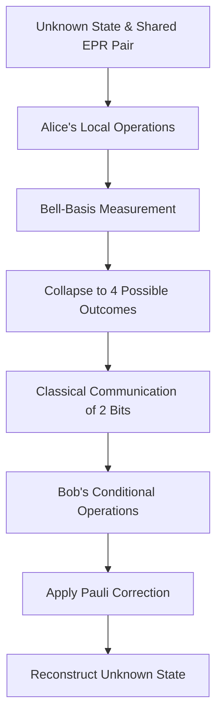

# Entanglement Protocols and Non-Locality

Entanglement is the quintessential quantum resource, violating Bell inequalities and enabling correlations unattainable by local hidden variables. 

- **Bell States**: The four maximally entangled two-qubit basis states, generated by applying $H$ on the control and $CNOT$ on the target. E.g., $|"\Phi^+\rangle = \frac{1}{\sqrt{2}}("|00\rangle + |"11\rangle)$.
- **Quantum Teleportation**: A protocol transferring unknown quantum information $"|\psi\rangle$ between distant nodes utilizing a pre-shared Bell pair and classical communication (CC).
  1. Alice entangles her unknown qubit with her half of the Bell pair.
  2. Alice performs a Bell-basis measurement, collapsing the state and yielding two classical bits.
  3. Alice transmits the two bits via CC.
  4. Bob applies conditional Pauli operations ($I, X, Z, XZ$) to his half of the pair, perfectly reconstructing $|\psi\rangle$.

