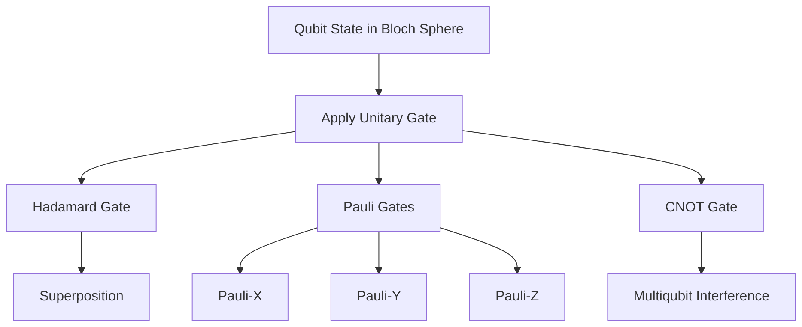

# Qubit Architecture and Unitary Operations

A qubit is a two-level quantum system defined in a complex vector space $\mathbb{C}^2$, represented geometrically on the **Bloch Sphere** by spherical coordinates ($\theta, \phi$). Operations are reversible unitary matrices $U$ where $U^{\dagger}U = I$.

- **Pauli Group**: 
  - $X$: Bit-flip ($\sigma_x$), $\pi$-rotation around x-axis.
  - $Y$: Bit-phase-flip ($\sigma_y$), $\pi$-rotation around y-axis.
  - $Z$: Phase-flip ($\sigma_z$), $\pi$-rotation around z-axis.
- **Hadamard ($H$)**: Maps $|0\rangle$ and $|1\rangle$ to mutually unbiased superposition states $(|0\rangle \pm |1\rangle)/\sqrt{2}$. Crucial for initiating phase interference.
- **CNOT**: The fundamental two-qubit entangling gate. Flips the target qubit conditionally based on the control qubit's state.

