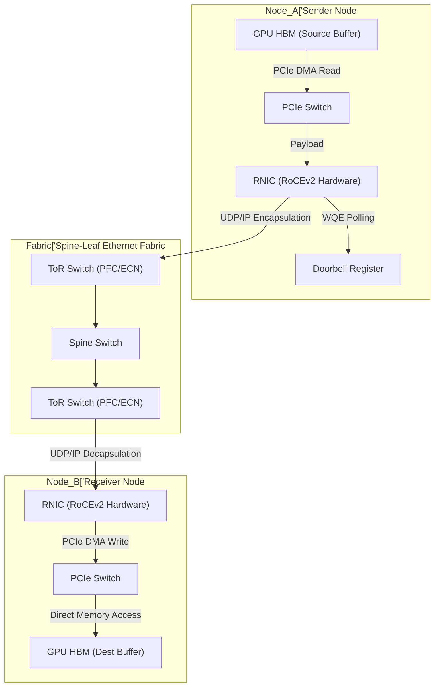

# RDMA & RoCEv2: Zero-Copy Silicon Datapaths

## Theoretical Foundations

Remote Direct Memory Access (RDMA) over Converged Ethernet v2 (RoCEv2) is the foundational interconnect protocol for exascale distributed training. It bypasses the traditional TCP/IP kernel stack, eliminating context switches, CPU interrupts, and intermediate buffer copies.

At the silicon level, RoCEv2 encapsulates InfiniBand (IB) transport headers within UDP/IP/Ethernet frames. The network interface card (NIC) hardware implements the entire transport layer. When a GPU initiates a memory write to a remote node, the memory controller (via PCIe or NVLink/NVSwitch) interacts directly with the NIC DMA engine.

## Datapath Analysis

1.  **Work Request Posting**: The sender application posts a Work Queue Element (WQE) to a Send Queue mapped directly in user-space hardware (Doorbell Register).
2.  **DMA Read**: The NIC hardware polls the WQE, parses the virtual address, translates it to a physical address via the IOMMU (or directly via ATS/PRI), and initiates a PCIe DMA Read from the source GPU HBM.
3.  **Encapsulation**: The NIC packet processing pipeline encapsulates the payload with IB Base Transport Header (BTH), UDP, IP, and Ethernet headers. Congestion control (DCQCN) metadata is stamped.
4.  **Network Transit**: The packet traverses Lossless Ethernet switches (PFC/ECN enabled).
5.  **Hardware Decapsulation & DMA Write**: The receiving NIC verifies the packet (ICRC/VCRC checks), extracts the virtual address from the memory payload, and performs a direct PCIe DMA Write to the destination GPU HBM. No kernel intervention occurs.

## Mermaid Flowchart: RoCEv2 GPU-to-GPU Datapath

