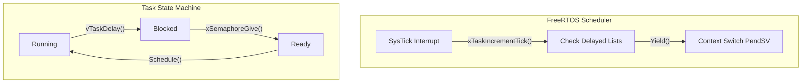

# Real-Time Operating Systems (RTOS) Mechanics

## Preemptive Scheduling and FreeRTOS Internals
FreeRTOS utilizes a priority-based, preemptive scheduling algorithm. The core data structure is `pxReadyTasksLists`, an array of `List_t` structures, one for each priority level up to `configMAX_PRIORITIES - 1`. The scheduler always selects the highest priority task in the ready state. Context switching is architecture-specific but fundamentally involves saving the CPU context onto the task's stack, updating the TCB (Task Control Block) stack pointer, and restoring the context of the newly selected task via a `PendSV` handler in ARM Cortex-M architectures.

## Priority Inheritance in Mutexes
To prevent priority inversion, FreeRTOS implements priority inheritance for its Mutex objects (which are specialized semaphores). When a high-priority task attempts to acquire a Mutex held by a lower-priority task, the scheduler temporarily elevates the priority of the mutex holder to match the blocked high-priority task. Upon releasing the mutex, the holder's original base priority is restored.

