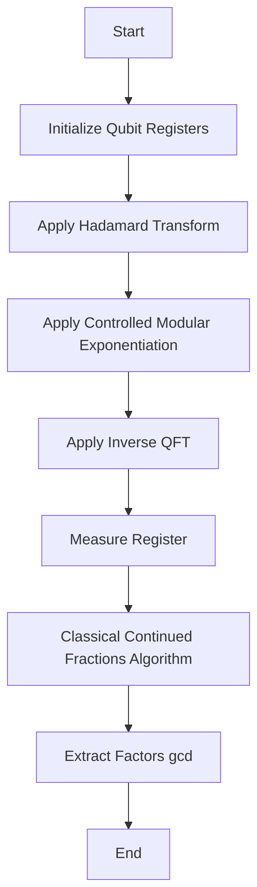

# Shor's Algorithm

Shor's algorithm achieves exponential speedup over classical algorithms for integer factorization. The core mechanism hinges on reducing factorization to the order-finding problem, subsequently solved via quantum phase estimation utilizing the Quantum Fourier Transform (QFT).

## Theoretical Foundation

Given an integer $N$ and a co-prime $a$, the algorithm finds the period $r$ of the function $f(x) = a^x \pmod N$. 
If $r$ is even and $a^{r/2} \not\equiv -1 \pmod N$, the factors of $N$ are $\gcd(a^{r/2} \pm 1, N)$.

The QFT transforms the computational basis state $|x\rangle$ into a superposition:
$$ QFT|x\rangle = \frac{1}{\sqrt{Q}} \sum_{y=0}^{Q-1} e^{2\pi i x y / Q} |y\rangle $$

## Actionable Execution

1. **State Preparation:** Initialize two registers. Apply Hadamard gates to create a uniform superposition in the evaluation register.
2. **Modular Exponentiation:** Apply a controlled unitary operation $U|y\rangle = |a y \bmod N\rangle$.
3. **Inverse QFT:** Apply QFT$^\dagger$ to the evaluation register to extract the phase (period $r$).
4. **Measurement & Classical Post-processing:** Measure the state, yielding a fraction $c/r$. Use continued fractions to deduce $r$.

## Execution Flow

